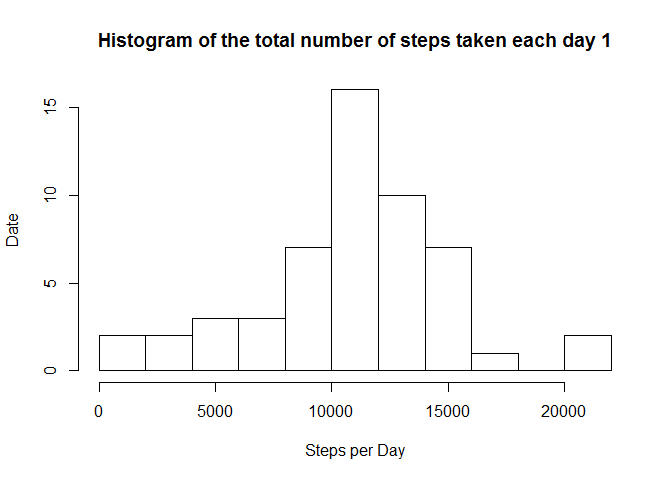
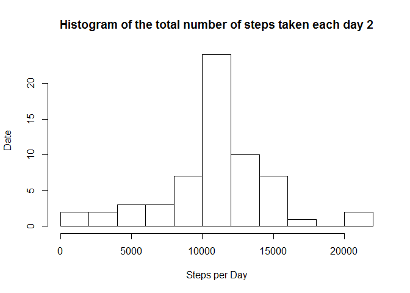

# Reproducible Research: Peer Assessment 1


## Loading and preprocessing the data

- Load the data (i.e. read.csv())

```r
myData <- read.csv("activity.csv")
```
## What is mean total number of steps taken per day?

- Make a histogram of the total number of steps taken each day

```r
totalNumberOfStepsTakenPerDay <- aggregate(steps ~ date, data = myData, FUN = sum)

hist(totalNumberOfStepsTakenPerDay$steps,
      main="Histogram of the total number of steps taken each day 1",
      breaks=10, 
      xlab="Steps per Day",
      ylab="Date")
```

 

- Calculate and report the mean and median of the total number of steps taken per day

```r
mean(totalNumberOfStepsTakenPerDay$steps)
```

```
## [1] 10766.19
```

```r
median(totalNumberOfStepsTakenPerDay$steps)
```

```
## [1] 10765
```

## What is the average daily activity pattern?

- Make a time series plot (i.e. type = "l") of the 5-minute interval (x-axis) and the average number of steps taken, averaged across all days (y-axis)

```r
fiveMinuteIntervals <- aggregate(steps ~ interval, data = myData, FUN = mean)   
plot(fiveMinuteIntervals, type = "l", xlab="Interval", ylab="Steps")
```

 

- Which 5-minute interval, on average across all the days in the dataset, contains the maximum number of steps?


```r
fiveMinuteIntervals$interval[which.max(fiveMinuteIntervals$steps)]
```

```
## [1] 835
```
## Imputing missing values

- Calculate and report the total number of missing values in the dataset (i.e. the total number of rows with NAs)

```r
sum(is.na(myData))
```

```
## [1] 2304
```

- Devise a strategy for filling in all of the missing values in the dataset. The strategy does not need to be sophisticated. For example, you could use the mean/median for that day, or the mean for that 5-minute interval, etc.

- Create a new dataset that is equal to the original dataset but with the missing data filled in.

```r
library(Hmisc)
```

```
## Warning: package 'Hmisc' was built under R version 3.1.3
```

```
## Loading required package: grid
## Loading required package: lattice
## Loading required package: survival
## Loading required package: splines
## Loading required package: Formula
## Loading required package: ggplot2
## 
## Attaching package: 'Hmisc'
## 
## The following objects are masked from 'package:base':
## 
##     format.pval, round.POSIXt, trunc.POSIXt, units
```

```r
newMyData <- myData
newMyData$steps <- with(newMyData, impute(steps, mean))

newTotalNumberOfStepsTakenPerDay <- tapply(newMyData$steps, newMyData$date, sum)
```

- Make a histogram of the total number of steps taken each day and Calculate and report the mean and median total number of steps taken per day. 

```r
hist(newTotalNumberOfStepsTakenPerDay,
      main="Histogram of the total number of steps taken each day 2",
      breaks=10, 
      xlab="Steps per Day",
      ylab="Date")
```

 

```r
mean(newTotalNumberOfStepsTakenPerDay)
```

```
## [1] 10766.19
```

```r
median(newTotalNumberOfStepsTakenPerDay)
```

```
## [1] 10766.19
```

- Do these values differ from the estimates from the first part of the assignment? 

Not much so.

- What is the impact of imputing missing data on the estimates of the total daily number of steps?

The impact of the missing data seems very low.

## Are there differences in activity patterns between weekdays and weekends?

- Create a new factor variable in the dataset with two levels – “weekday” and “weekend” indicating whether a given date is a weekday or weekend day.


```r
dayType <- function(date) {
    if(weekdays(as.Date(date)) %in% c("Saturday", "Sunday")) {
        day <- "Weekend"
    } else {
        day <- "Weekday"
    }
}

newMyData$dayType <- as.factor(sapply(newMyData$date, dayType))
```

- Make a panel plot containing a time series plot (i.e. type = "l") of the 5-minute interval (x-axis) and the average number of steps taken, averaged across all weekday days or weekend days (y-axis). 


```r
library(reshape2)

melted <- melt(newMyData, measure.vars="steps")

meanSteps <- dcast(melted, dayType+interval~variable, mean)

library(lattice)

xyplot(steps~interval|dayType,
    data=meanSteps,
    xlab="Interval",
    ylab="Number of steps",
    type="l",
    layout=c(1,2)
)
```

 


